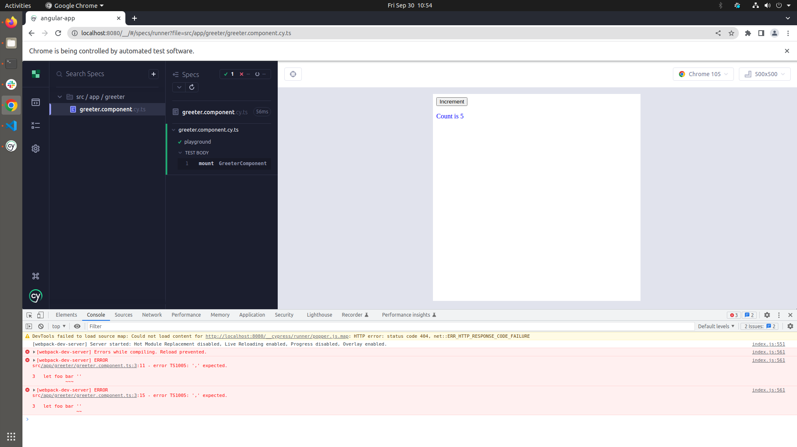
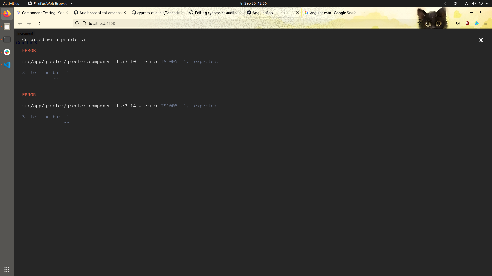
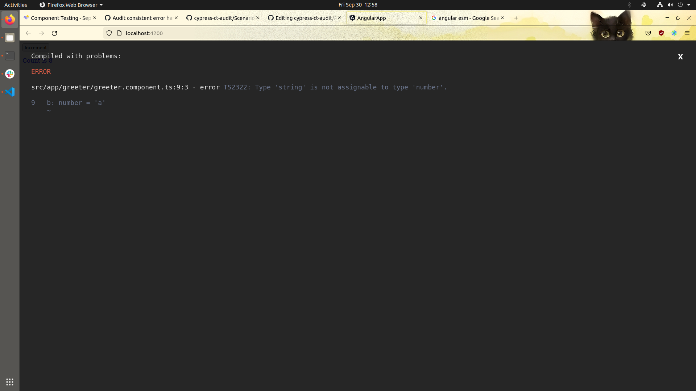
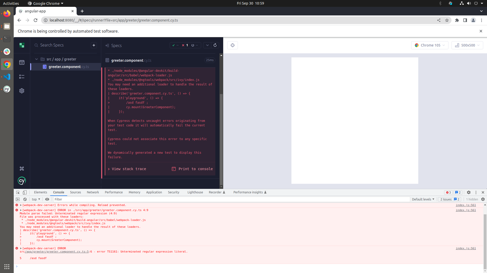
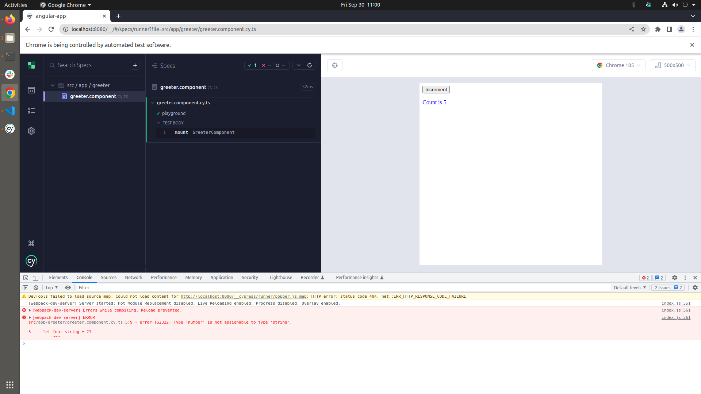
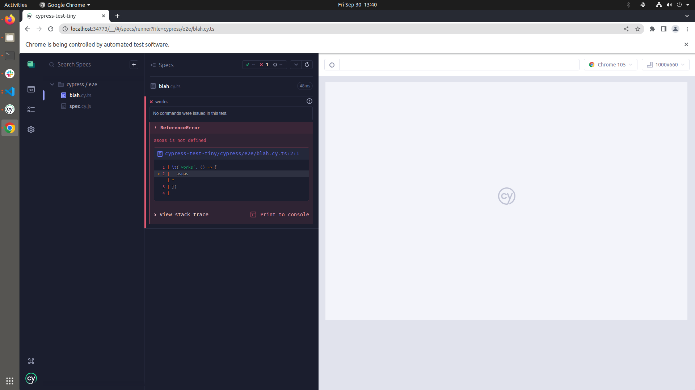
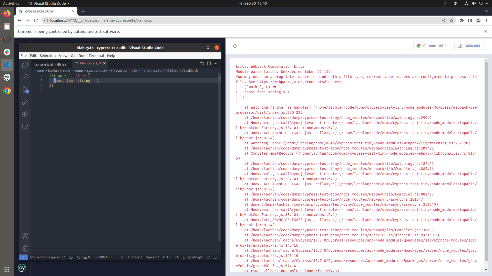

# Angular DX Check

## Onboarding

I did `npm install -g @angular/cli`. I made a new app and a simple component - works great. I included SCSS and Routing.

Onboarding worked as expected - all the files were generated in the correct places.

## First Test

I wrote a simple test for my component `<Greeter />`:

```ts
import { Component, OnInit } from '@angular/core';

@Component({
  selector: 'greeter',
  templateUrl: './greeter.component.html',
  styleUrls: ['./greeter.component.scss']
})
export class GreeterComponent implements OnInit {
  count = 5

  constructor() { }

  ngOnInit(): void {
  }

  increment () {
    this.count++
  }
}
```

And added a test:

```ts
import { GreeterComponent } from './greeter.component'

describe('greeter.component.cy.ts', () => {
  it('playground', () => {
    cy.mount(GreeterComponent)
  })
})
```

Also works great. `cy.mount` has no squigglies - the types were found correctly (surprisingly; this is often not the case). The correct types for `describe` were also found (no conflict with Jest, etc - since Angular does not use Jest).


# Errors

## User App Error

I added some invalid code:

```ts
import { Component, OnInit } from '@angular/core';

  let foo bar '' 

 @Component({
  selector: 'greeter',
  templateUrl: './greeter.component.html',
  styleUrls: ['./greeter.component.scss']
})
export class GreeterComponent implements OnInit {
  count = 5
  // ...
```

In this case, I don't see anything unless I open the console:



This is in constrast to the default DX when running `npm run serve`, which is an actual overlay:




Same result for valid code, but a typing error:

```ts
import { Component, OnInit } from '@angular/core';

 @Component({
  selector: 'greeter',
  templateUrl: './greeter.component.html',
  styleUrls: ['./greeter.component.scss']
})
export class GreeterComponent implements OnInit {
  const foo: number = ''
```


In the actual app, you get an overlay (both invalid JS and incorrect types are considered errors, prompting an overlay):



## Test Code Error

I changed my test to have invalid code:

```ts
import { GreeterComponent } from './greeter.component'

describe('greeter.component.cy.ts', () => {
  it('playground', () => {
    /asd fasdf 
    cy.mount(GreeterComponent)
  })
})
```

This shows an error in Command Log. This seems better.



A typing error doesn't show up - I think this is fine, as far as DX goes - since the code does function (TypeScript is running with `transpileOnly`, presumably). The error IS logged to the console.

```ts
import { GreeterComponent } from './greeter.component'

describe('greeter.component.cy.ts', () => {
  it('playground', () => {
    let foo: string = 21
    cy.mount(GreeterComponent)
  })
})
```



# Comparison with End to End

It's worth noting E2E is also inconsistent. 

## TypeScript without `@cypress/webpack-preprocessor` - Invalid JS

Error in Command Log.



## TypeScript without `@cypress/webpack-preprocessor` - Type Error

No error (Command Log or console).

## TypeScript with `@cypress/webpack-preprocessor` - Invalid JS

Error in Command Log.


## TypeScript with `@cypress/webpack-preprocessor` - Type Error

Error in overlay.



# Analysis

Broadly speaking, there are two classes of errors:

- App code errors (in the component files, for example). This represents something that would block deployment, since Angular won't compile).
- Test code errors. This code is not part of the production bundle.

Both categories have two type of coding error:
  - Invalid code. Example: `let foo const /*** string`
  - Incorrect types. Example: `const foo: string = 123`

| Code | Type of Error | Current Behavior 
| -- | -- | -- | 
| App Code | Invalid JS | console.error | 
| App Code | Typing Error | console.error |
| Spec Code | Invalid JS | Command Log | 
| Spec Code | Typing Error | console.error | 

There is *three* places errors can manifest.

1. Command Log
2. console
3. AUT overlay

# Recommendations

## Invalid JS errors (eg, the code cannot be executed):

I'd recommend following End to End Testing's current pattern, which is to show an error in the Command Log, pointing to the location of the error.

I don't think the AUT is a good place for a compilation error. The Command Log (ala the Reporter) should report any problems, that's the whole point of it. I don't like it when test codes shows up in the AUT. It's supposed to be the production-like, and you don't show compilation errors in a big overlay in production.

## Typing Errors

I don't think this should show in the Command Log *or* the AUT. Component Testing, and Cypress in general, is *not* a staic analysis tool. We tell you if you code does what is says it does, regarding rendering and interactions. We should leave typing errors to a the IDE or a separate `tsc` process. Most build tools have something built in to prevent you from compiling code with typing errors.

# Conclusion

Errors should be showing in the Command Log where possible, or in the console.error as a worst case scenario. They should not show in the AUT (regardless of whether they are related to typing, compilation, or linting).