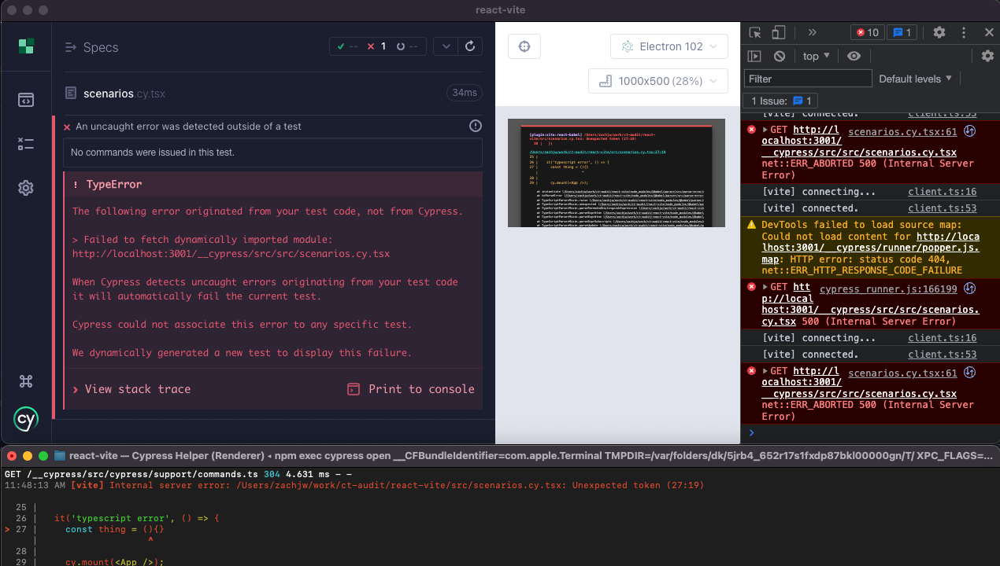
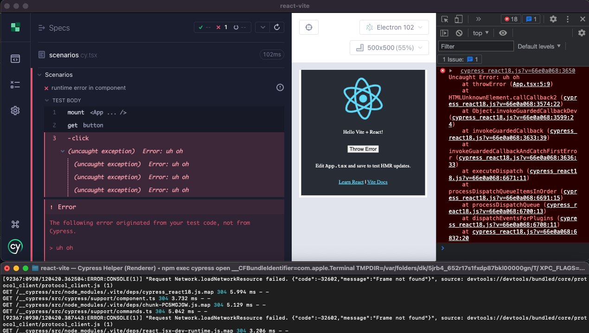

# Errors

## ESLint Warning

```ts
it("eslint warning", () => {
  5 + 5; // Unused expression
  cy.mount(<App />);
});
```

**Cypress**

|    Framework     | Terminal Log | Console Log | Reporter Error | Code Frame | DevServer Overlay | Test Failed |
| :--------------: | :----------: | :---------: | :------------: | :--------: | :---------------: | :---------: |
|     angular      |              |             |                |            |                   |             |
| create-react-app |      x       |             |                |            |                   |             |
|       next       |              |             |                |            |                   |             |
|       nuxt       |              |             |                |            |                   |             |
|    react-vite    |              |             |                |            |                   |             |
|     vue-cli      |              |             |                |            |                   |             |

**App**

|    Framework     | Terminal Log | Console Log | DevServer Overlay |
| :--------------: | :----------: | :---------: | :---------------: |
|     angular      |              |             |                   |
| create-react-app |      x       |             |                   |
|       next       |              |             |                   |
|       nuxt       |              |             |                   |
|    react-vite    |              |             |                   |
|     vue-cli      |              |             |                   |

### Summary

`create-react-app` is the only framework that has ESLint integrated into the compilation.
TODO: Make note of ENV variables that customize this behavior

- `create-react-app`
  > 

## ESLint Error

```ts
it("eslint error", () => {
  let thing = "Hello World!"; // Unused var
  cy.mount(<App />);
});
```

**Cypress**

|    Framework     | Terminal Log | Console Log | Reporter Error | Code Frame | DevServer Overlay | Test Failed |
| :--------------: | :----------: | :---------: | :------------: | :--------: | :---------------: | :---------: |
|     angular      |              |             |                |            |                   |             |
| create-react-app |      x       |             |                |            |                   |             |
|       next       |              |             |                |            |                   |             |
|       nuxt       |              |             |                |            |                   |             |
|    react-vite    |              |             |                |            |                   |             |
|     vue-cli      |              |             |                |            |                   |             |

**App**

|    Framework     | Terminal Log | Console Log | DevServer Overlay |
| :--------------: | :----------: | :---------: | :---------------: |
|     angular      |              |             |                   |
| create-react-app |      x       |             |         x         |
|       next       |              |             |                   |
|       nuxt       |              |             |                   |
|    react-vite    |              |             |                   |
|     vue-cli      |              |             |                   |

### Summary

`create-react-app` is the only framework with eslint integrated in the compilation.
TODO: Make note of ENV variables that customize this behavior
TODO: create-react-app error needs to be resolved in app before hmr works

- `create-react-app`
  > 

## Typescript Warning

```ts
it("typescript warning", () => {
  let thing: number = "Hello World"; // number is not assignable to string

  cy.mount(<App thing={thing} />);
});
```

**Cypress**

|    Framework     | Terminal Log | Console Log | Reporter Error | Code Frame | DevServer Overlay |
| :--------------: | :----------: | :---------: | :------------: | :--------: | :---------------: |
|     angular      |      x       |      x      |                |            |                   |
| create-react-app |      x       |             |                |            |                   |
|       next       |              |             |                |            |                   |
|       nuxt       |      x       |      x      |                |            |                   |
|    react-vite    |              |             |                |            |                   |
|     vue-cli      |      x       |      x      |                |            |                   |

**App**

|    Framework     | Terminal Log | Console Log | DevServer Overlay |
| :--------------: | :----------: | :---------: | :---------------: |
|     angular      |      x       |      x      |         x         |
| create-react-app |      x       |             |         x         |
|       next       |              |             |                   |
|       nuxt       |      x       |             |                   |
|    react-vite    |              |             |                   |
|     vue-cli      |      x       |             |         x         |

- `angular`

  > 

- `create-react-app`

  > 

- `nuxt`

  > 

- `vue-cli`

  > 

## Typescript Error (Compilation Error)

```ts
it('typescript error', () => {
  {}/()aa>

  cy.mount(<App />);
})
```

**Cypress**

|    Framework     | Terminal Log | Console Log | Reporter Error | Code Frame | DevServer Overlay | Test Failed |
| :--------------: | :----------: | :---------: | :------------: | :--------: | :---------------: | :---------: |
|     angular      |      x       |      x      |       x        |            |                   |      x      |
| create-react-app |      x       |             |       x        |            |                   |      x      |
|       next       |      x       |      x      |       x        |     x      |                   |      x      |
|       nuxt       |      x       |      x      |       x        |            |                   |      x      |
|    react-vite    |      x       |             |       x        |            |         x         |      x      |
|     vue-cli      |      x       |      x      |       x        |            |                   |      x      |

**App**

|    Framework     | Terminal Log | Console Log | DevServer Overlay |
| :--------------: | :----------: | :---------: | :---------------: |
|     angular      |      x       |      x      |         x         |
| create-react-app |      x       |             |         x         |
|       next       |      x       |      x      |         x         |
|       nuxt       |      x       |      x      |         x         |
|    react-vite    |      x       |      x      |         x         |
|     vue-cli      |      x       |             |         x         |

- `angular`

  > 

- `create-react-app`

  > 

- `next`

  > 

- `nuxt`

  > 

- `react-vite`

  > 

- `vue-cli`

  > 

## Runtime Error (App)

```ts
it("runtime error in component", () => {
  cy.mount(<App />);
  cy.get("button").click(); // Wired up to button that throws error
});
```

**Cypress**

|    Framework     | Terminal Log | Console Log | Reporter Error | Code Frame | DevServer Overlay | Test Failed |
| :--------------: | :----------: | :---------: | :------------: | :--------: | :---------------: | :---------: |
|     angular      |              |      x      |                |            |                   |             |
| create-react-app |              |      x      |       x        |     x      |                   |      x      |
|       next       |              |      x      |       x        |     x      |                   |      x      |
|       nuxt       |              |      x      |                |            |                   |             |
|    react-vite    |              |      x      |       x        |            |                   |      x      |
|     vue-cli      |              |      x      |       x        |    x\*     |                   |      x      |

**App**

|    Framework     | Terminal Log | Console Log | DevServer Overlay |
| :--------------: | :----------: | :---------: | :---------------: |
|     angular      |              |      x      |                   |
| create-react-app |              |      x      |                   |
|       next       |              |      x      |         x         |
|       nuxt       |              |      x      |        x\*        |
|    react-vite    |              |      x      |                   |
|     vue-cli      |              |      x      |                   |

- `angular`

  > 

- `create-react-app`

  > 

- `next`

  > 

- `nuxt`

  > 

- `react-vite`

  > 

- `vue-cli`

  > 

## Runtime Error (Test)

```ts
it("runtime error in spec", () => {
  throw new Error("uh oh");
  cy.mount(<App />);
});
```

**Cypress**

|    Framework     | Terminal Log | Console Log | Reporter Error | Code Frame | DevServer Overlay | Test Failed |
| :--------------: | :----------: | :---------: | :------------: | :--------: | :---------------: | :---------: |
|     angular      |              |             |       x        |     x      |                   |      x      |
| create-react-app |              |             |       x        |     x      |                   |      x      |
|       next       |              |             |       x        |     x      |                   |      x      |
|       nuxt       |              |             |       x        |     x      |                   |      x      |
|    react-vite    |              |             |       x        |     x      |                   |      x      |
|     vue-cli      |              |             |       x        |     x      |                   |      x      |

- `angular`

  > 

- `create-react-app`

  > 

- `next`

  > 

- `nuxt`

  > 

- `react-vite`

  > 

- `vue-cli`

  > 

# Onboarding

## Nuxt

Nuxt's on-boarding experience did not have any configuration issues. Typescript and ESLint configurations did not need modified.
It was able to utilize Create Spec from Vue Component.

The issues experienced during the on-boarding experience were:
1. Page shows component name in the command log as `<f .../>` instead of the component name (See nuxt screenshots above)
2. When hovering over `Mount` in the command log, the AUT shows a blank view. This should probably display the mounted component
3. The user has to add any children component into the `components` object in the exported object. This is not required when running the app in dev mode.


