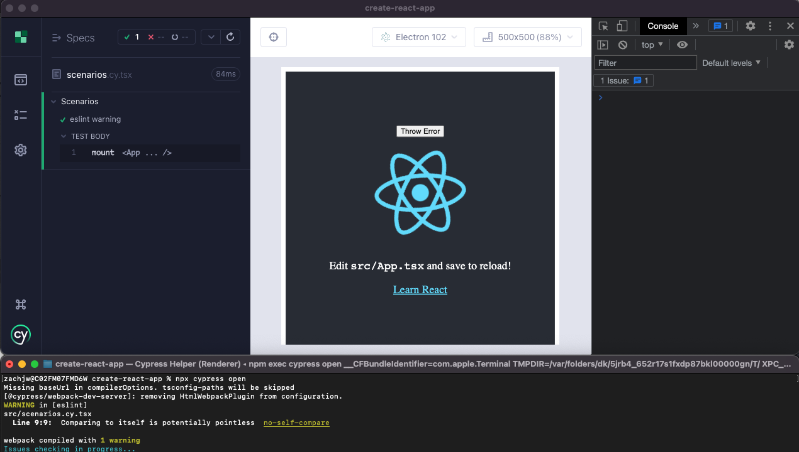
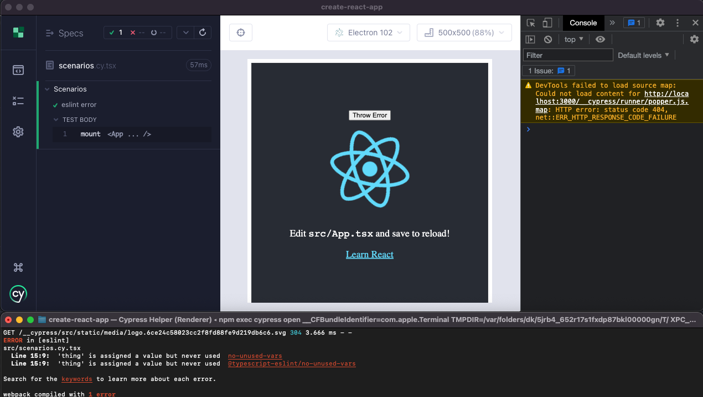
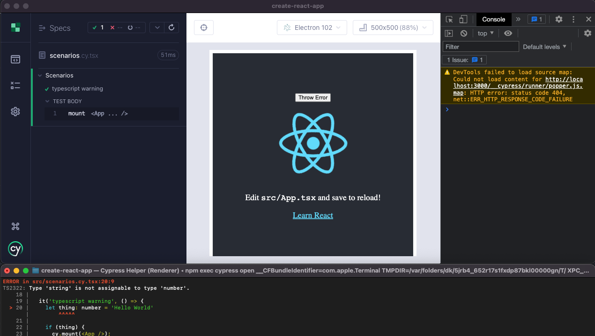
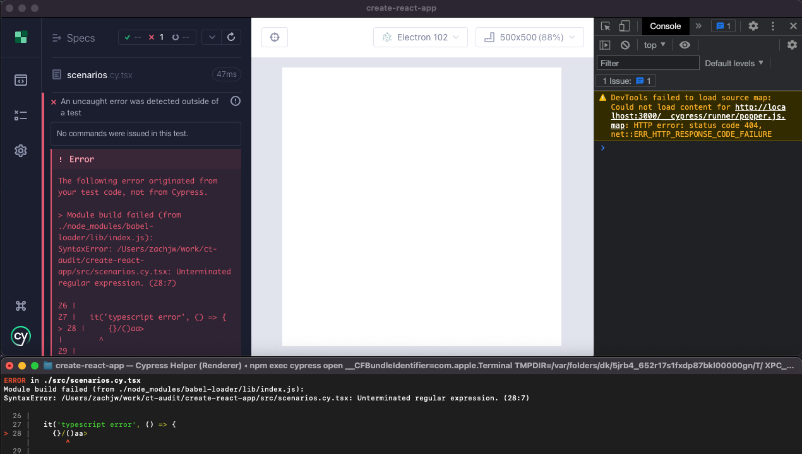
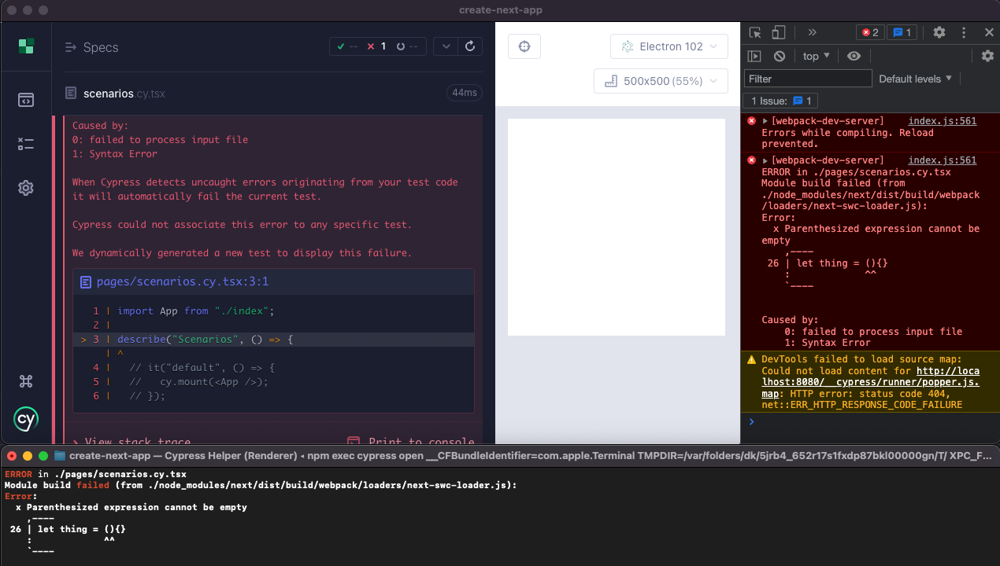
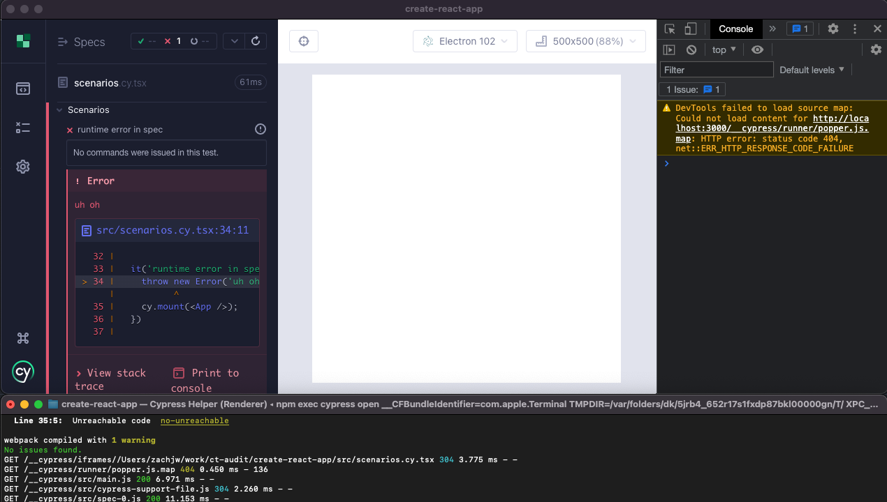
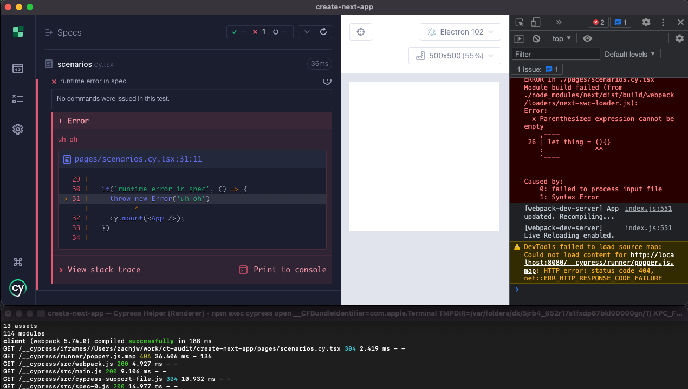
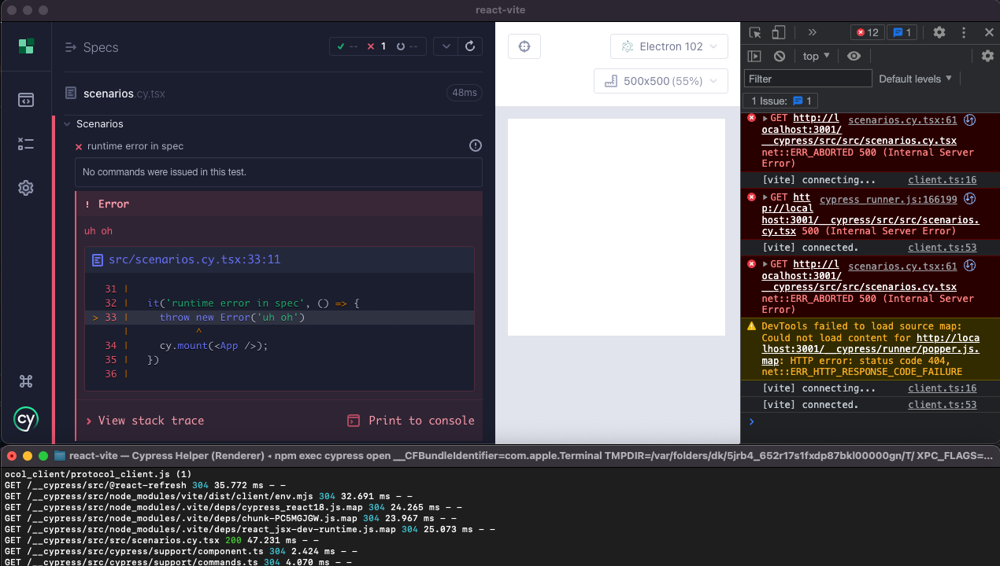
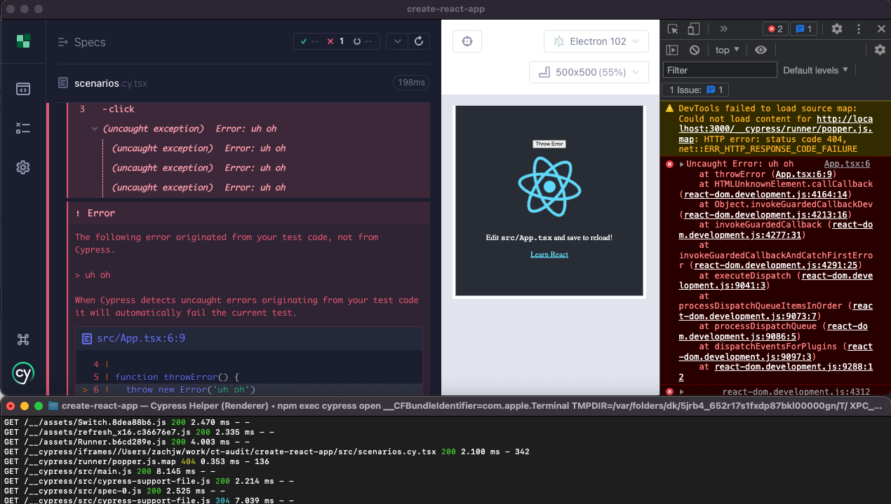
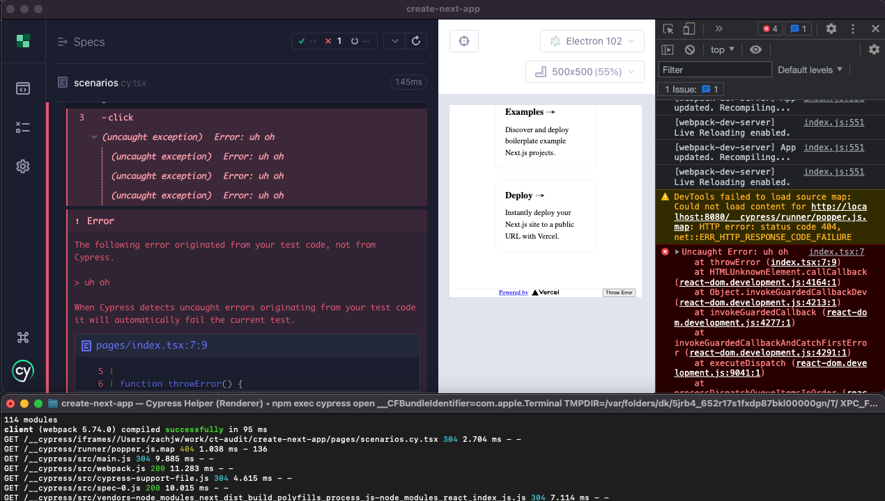

# Errors

## ESLint Warning

```ts
it('eslint warning', () => {
  5 + 5 // Unused expression
  cy.mount(<App />);
})
```

| Framework        | Terminal Log | Console Log | Reporter Error | Code Frame | DevServer Overlay | Error needs to be resolved |
| ---------------- | ------------ | ----------- | -------------- | ---------- | ----------------- | -------------------------- |
| create-react-app |              |             |                |            |                   |                            |
| next             |              |             |                |            |                   |                            |
| nuxt             |              |             |                |            |                   |                            |
| vue-cli          |              |             |                |            |                   |                            |
| angular          |              |             |                |            |                   |                            |
| react-vite       |              |             |                |            |                   |                            |

- `create-react-app`
  - Cypress: Terminal log
  - In App: Terminal log
  > 

- `create-next-app`: N/A ESLint is not integrated into Webpack build

- `react-vite`: N/A not integrated into Vite build (opt-in)

## ESLint Error

```ts
it('eslint error', () => {
  let thing = 'Hello World!' // Unused var
  cy.mount(<App />);
})
```

- `create-react-app`
  - Cypress: Terminal log
  - In App: Terminal log, DevServer overlay, live-reload/hmr does not work until error is resolved
  > 

- `create-next-app`: N/A ESLint is not integrated into Webpack build

- `react-vite`: N/A not integrated into Vite build (opt-in)

## Typescript Warning

```ts
it('typescript warning', () => {
  let thing: number = 'Hello World' // number is not assignable to string

  cy.mount(<App thing={thing} />);
})
```

- `create-react-app`
  - Cypress: Terminal log
  - In App: Terminal log, DevServer overlay
  > 

- `create-next-app`: N/A Typecheck is not integrated into Webpack build

`react-vite`: N/A Typecheck is not integrated into Vite build (opt-in)

## Typescript Error

```ts
it('typescript error', () => {
  {}/()aa>

  cy.mount(<App />);
})
```

- `create-react-app`
  - Cypress: Terminal log, failed test
  - In App: Terminal log, DevServer overlay, live-reload/hmr does not work until error is resolved
  > 

- `create-next-app`
  - Cypress: Terminal log, Error in Reporter with stack frame, failed test
  - In App: Terminal log, DevServer overlay, live-reload/hmr does not work until error is resolved
  > 

- `react-vite`
  - Cypress: Terminal log, Error in Reporter, DevServer overlay, failed test
  - In App: Terminal log, DevServer overlay, live-reload/hmr does not work until error is resolved
  - [](./react-vite-typescript-error.png)

## Runtime Error (Test)

```ts
it('runtime error in spec', () => {
  throw new Error('uh oh')
  cy.mount(<App />);
})
```

- `create-react-app`
  - Cypress: Error in reporter with code-frame, live-reload/hmr does not work until error is resolved, failed test
  > 

- `create-next-app`
  - Cypress: Terminal log, Error in Reporter with stack frame, failed test
  > 

- `react-vite`
  - Cypress: Terminal log, Error in Reporter with stack frame, DevServer overlay, failed test
  > 

## Runtime Error (App)

```ts
it("runtime error in component", () => {
  cy.mount(<App />);
  cy.get('button').click(); // Wired up to button that throws error
});
```

- `create-react-app`
  - Cypress: Console log, Error in reporter with code-frame, failed test
  - In App: Console log
  > 

- `create-next-app`
  - Cypress: Terminal log, Error in Reporter with stack frame, failed test
  - In App: Console log, DevServer overlay
  > 

- `react-vite`
  - Cypress: Console log, Error in reporter, failed test
  - In App: Console log