# Errors

## ESLint Warning

```ts
it('eslint warning', () => {
  5 + 5 // Unused expression
  cy.mount(<App />);
})
```

- `create-react-app`
  - Cypress: Terminal log
  - In App: Terminal log
  > 

- `Nuxt`
  - Cypress: N/A ESLint is not integrated into Webpack build
  - In App: N/A ESLint is not integrated into Webpack build

- `vue-cli`
  - Cypress: N/A ESLint is not integrated into Webpack build
  - In App: N/A ESLint is not integrated into Webpack build

- `Angular`
  - Cypress: N/A ESLint is not integrated into build
  - In App: N/A ESLint is not integrated into build

## ESLint Error

```ts
it('eslint error', () => {
  let thing = 'Hello World!' // Unused var
  cy.mount(<App />);
})
```

- `create-react-app`
  - Cypress: Terminal log
  - In App: Terminal log, DevServer overlay, live-reload/hmr does not work until error is resolved
  > 

- `nuxt` 
  - Cypress: N/A ESLint is not integrated into Webpack build
  - In App: Terminal Log

- `vue-cli`
  - Cypress: N/A ESLint is not integrated into Webpack build
  - In App: N/A ESLint is not integrated into Webpack build

- `Angular`
  - Cypress: N/A ESLint is not integrated into build
  - In App: N/A ESLint is not integrated into build

## Typescript Warning

```ts
it('typescript warning', () => {
  let thing: number = 'Hello World' // number is not assignable to string

  cy.mount(<App thing={thing} />);
})
```

- `create-react-app`
  - Cypress: Terminal log
  - In App: Terminal log, DevServer overlay
  > 

- `nuxt`
  - Cypress: Terminal log, Console log
  - In App: Terminal log
  > 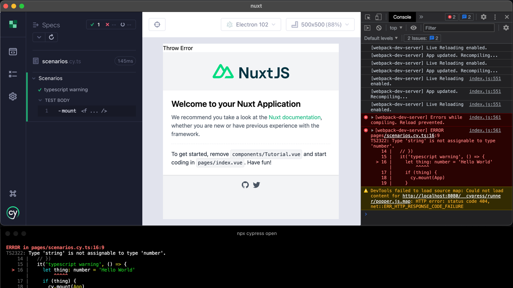

- `vue-cli`
  - Cypress: Terminal log, Console log
  - In App: Terminal Log, Deverver overlay
  > 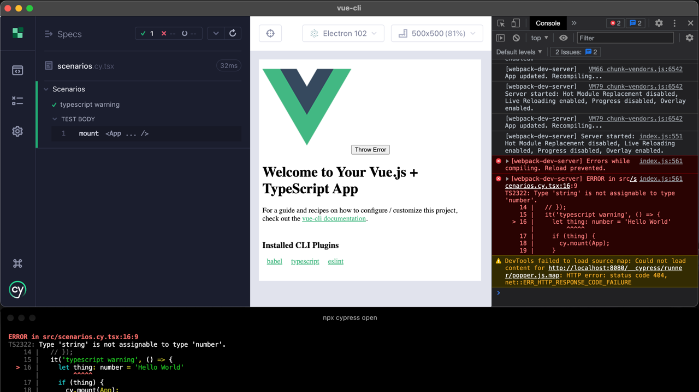

- `Angular`
  - Cypress: Terminal log, Console log
  - In App: Terminal log, DevServer overlay, live-reload/hmr does not work until error is resolved
  > 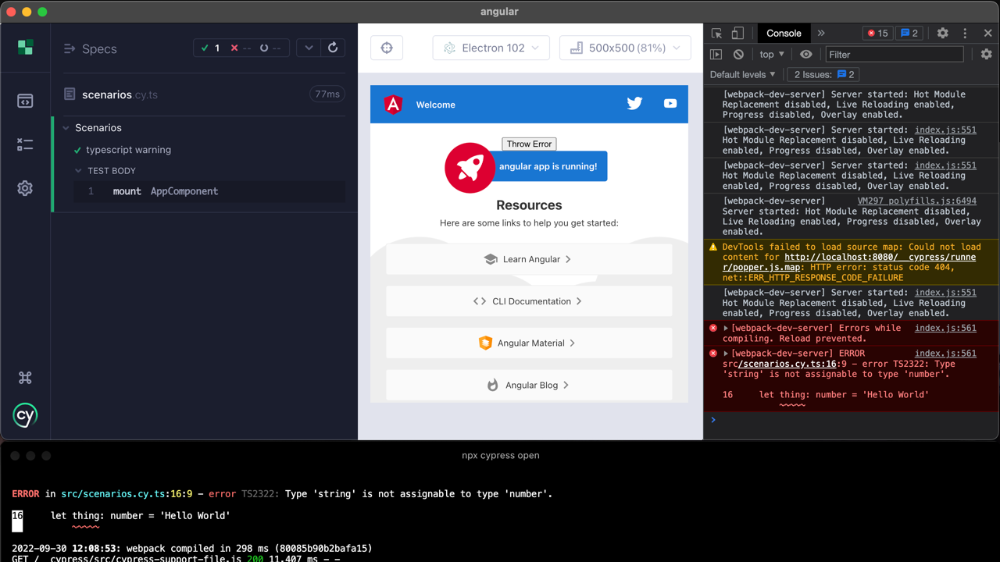

## Typescript Error

```ts
it('typescript error', () => {
  {}/()aa>

  cy.mount(<App />);
})
```

- `create-react-app`
  - Cypress: Terminal log, failed test
  - In App: Terminal log, DevServer overlay, live-reload/hmr does not work until error is resolved
  > 

- `nuxt`
  - Cypress: Terminal Log, Console Log, Reporter Log, Failed Test
  - In App: Terminal Log, Devserver overlay, live-reload/hmr does not work until error is resolved
  > 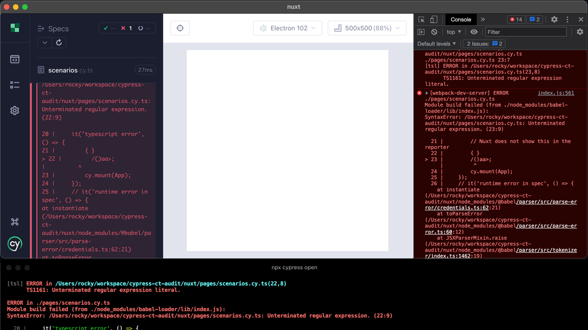

- `vue-cli`
  - Cypress: Terminal Log, Console Log, Reporter Log, Failed Test
  - In App: Terminal log, Devserver overlay, live-reload/hmr does not work until error is resolved
  > 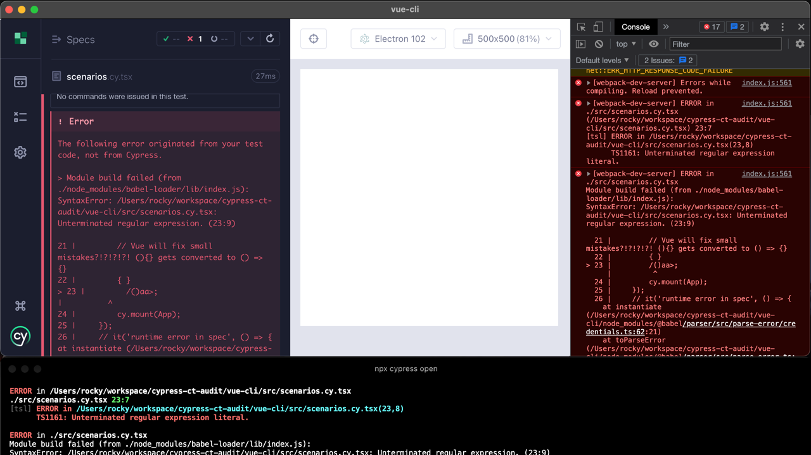
- `Angular`
  - Cypress: Terminal Log, Console Log, Reporter Log, Failed Test
  - In App: Terminal log, Devserver overlay, live-reload/hmr does not work until error is resolved
  > 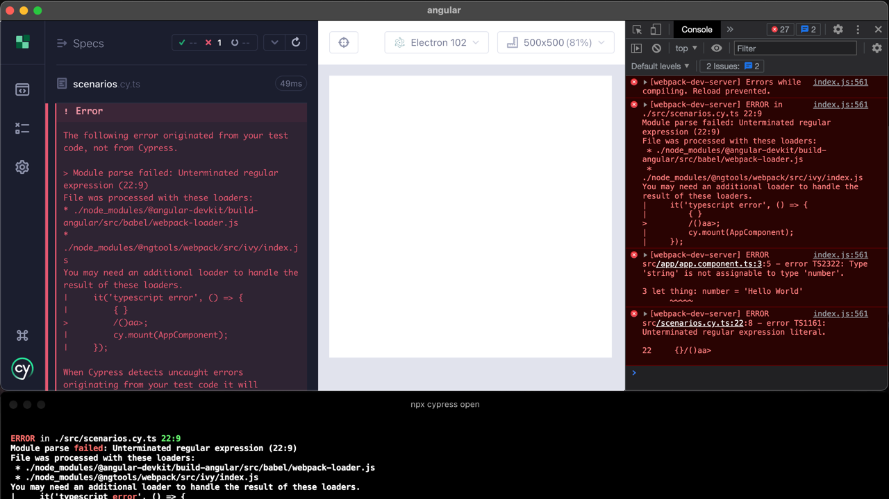

## Runtime Error (Test)

```ts
it('runtime error in spec', () => {
  throw new Error('uh oh')
  cy.mount(<App />);
})
```

- `create-react-app`
  - Cypress: Error in reporter with code-frame, live-reload/hmr does not work until error is resolved, failed test
  > 

- `nuxt`
  - Cypress: Error in reporter with code-frame, live-reload/hmr does not work until error is resolved, failed test
  > 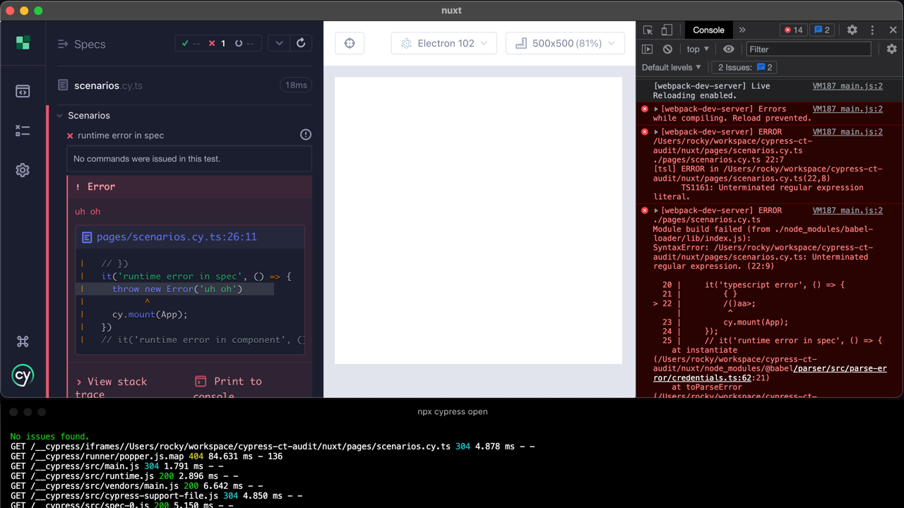

- `vue-cli`
  - Cypress: Error in reporter with code-frame, live-reload/hmr does not work until error is resolved, failed test
  > 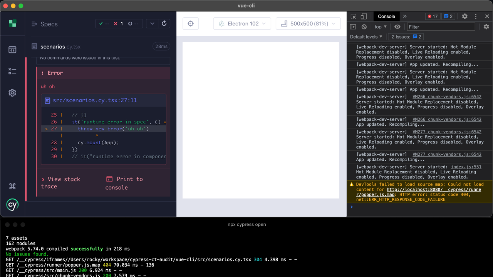

- `Angular`
  - Cypress: Error in reporter with code-frame, live-reload/hmr does not work until error is resolved, failed test
  > 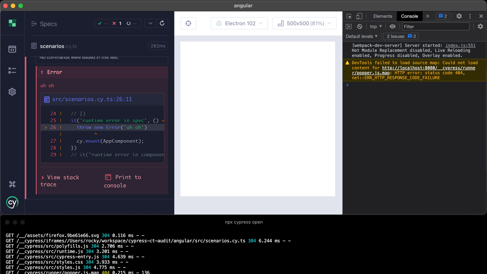

## Runtime Error (App)

```ts
it("runtime error in component", () => {
  cy.mount(<App />);
  cy.get('button').click(); // Wired up to button that throws error
});
```

- `create-react-app`
  - Cypress: Console log, Error in reporter with code-frame, failed test
  - In App: Console log
  > 

- `nuxt`
  - Cypress: Console Log, Test Passes
  - In App: DevServer Overlay, Console Log
  > 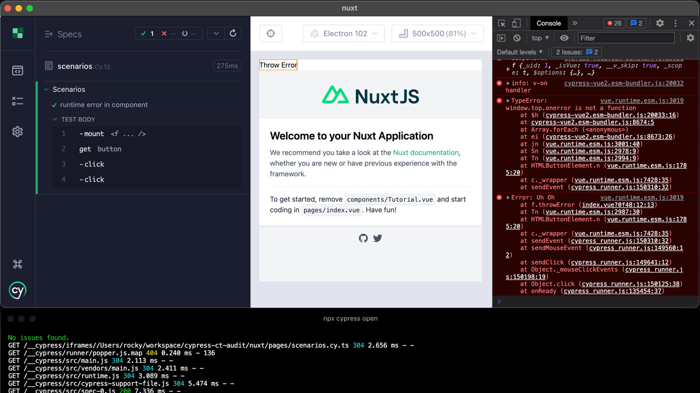

- `vue-cli`
  - Cypress: Console Log, Error in reporter with code-frame, Test Passes
  - In App: Console Log
  > 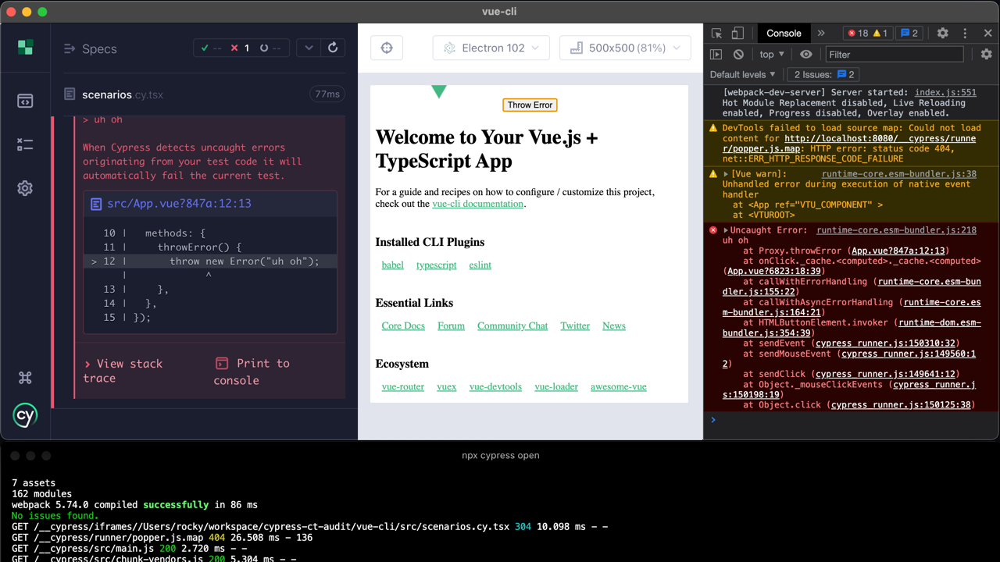

- `Angular`
  - Cypress: Console Log Test Passes
  - In App: Console Log
  > 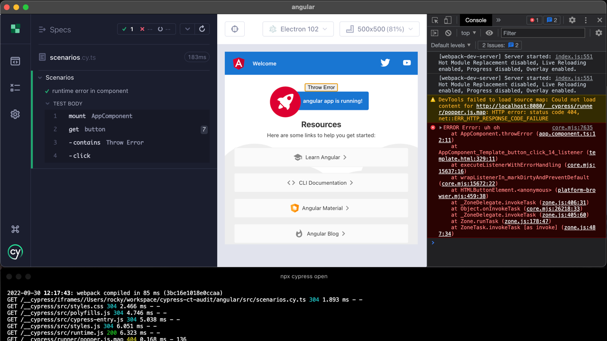
